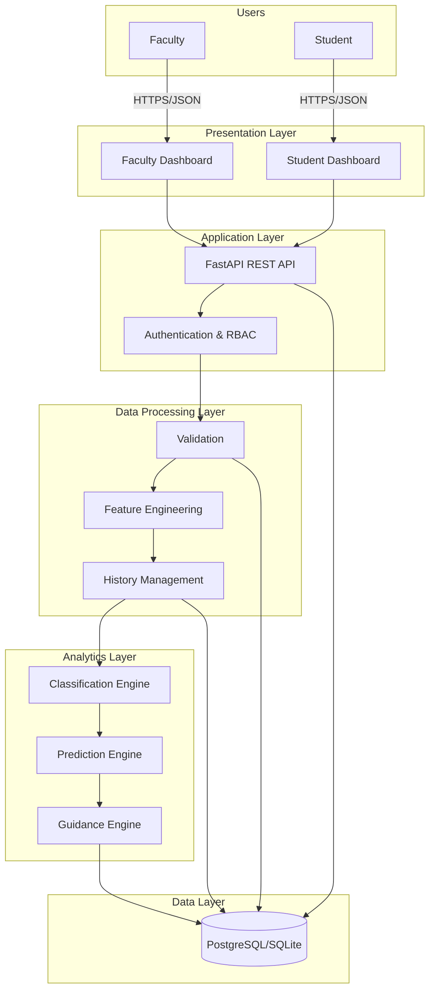
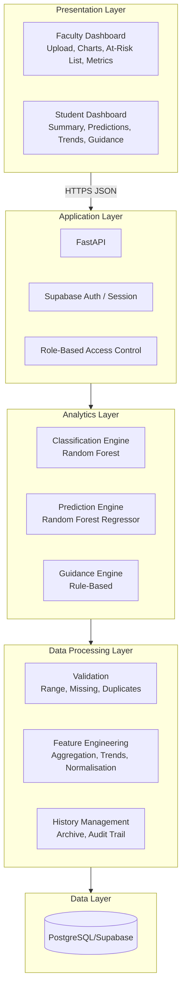
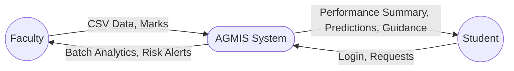
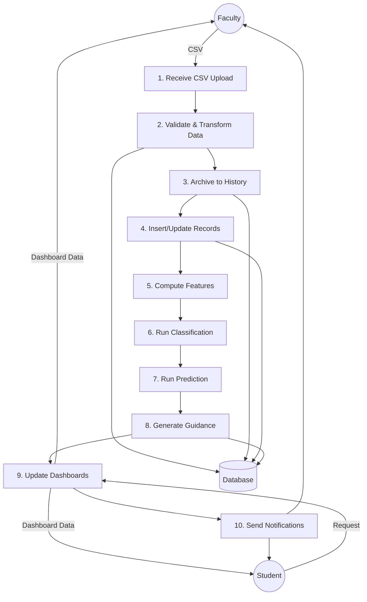
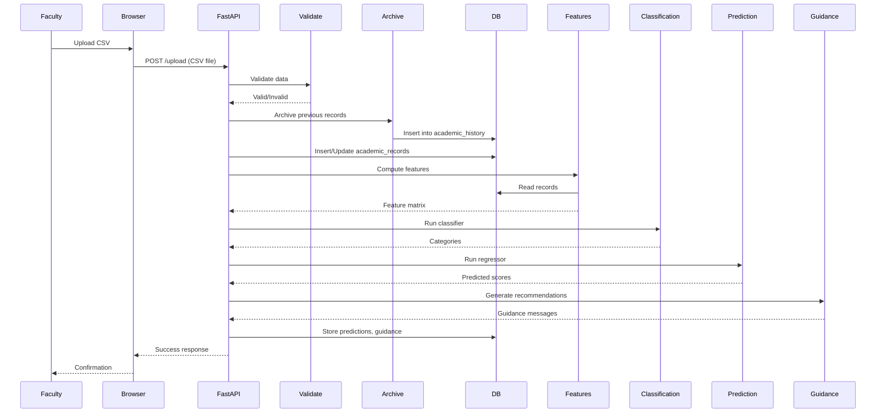
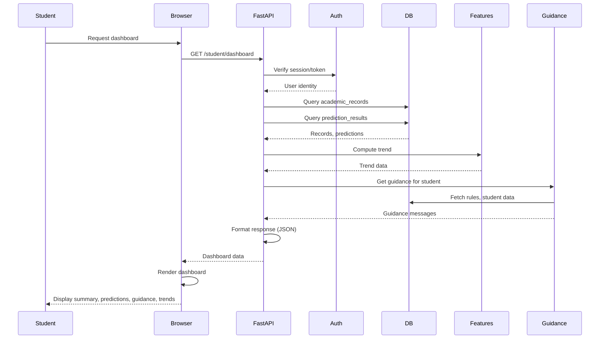
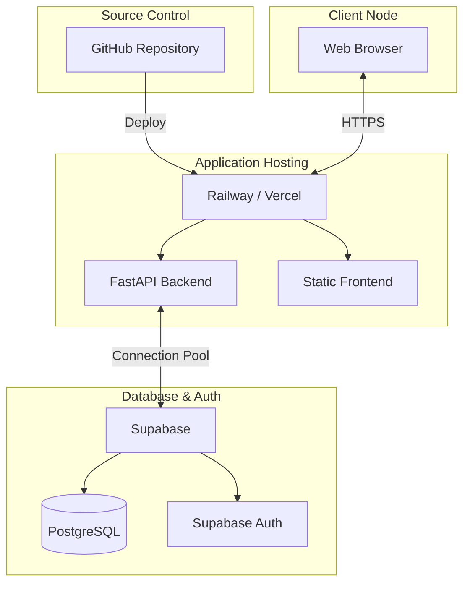
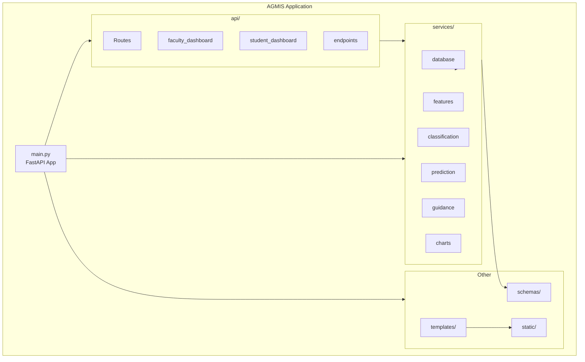
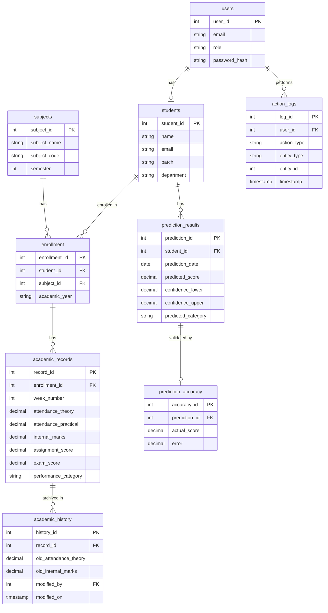

# AGMIS System Diagrams

All diagrams for the AGMIS Blackbook Report (Chapter 4). These use Mermaid syntax and can be rendered in GitHub, GitLab, VS Code (with Mermaid extension), or exported to PNG/SVG using [Mermaid Live Editor](https://mermaid.live) or `mermaid-cli`.

---

## Figure 4.1: Overall System Architecture

---

## Figure 4.2: Five-Layer Architecture (Component Interaction)

---

## Figure 4.3: Context Diagram (DFD Level 0)

---

## Figure 4.4: Data Flow Diagram Level 1

---

## Figure 4.5: Use Case Diagram

```mermaid
flowchart TB
    subgraph Actors
        Faculty((Faculty))
        Student((Student))
        Admin((Admin))
    end

    subgraph FacultyUC["Faculty Use Cases"]
        UC1[Upload Attendance]
        UC2[Upload Marks]
        UC3[View Batch Analytics]
        UC4[View At-Risk Students]
        UC5[View Individual Student Profile]
        UC6[Export Credentials CSV]
        UC7[Receive Critical Alerts]
    end

    subgraph StudentUC["Student Use Cases"]
        UC8[View Performance Summary]
        UC9[View Predicted Score]
        UC10[View Guidance]
        UC11[View Trend Graph]
    end

    subgraph AdminUC["Admin Use Cases"]
        UC12[Manage Faculty Accounts]
        UC13[Configure Rules]
        UC14[View Audit Logs]
    end

    Faculty --> UC1 & UC2 & UC3 & UC4 & UC5 & UC6 & UC7
    Student --> UC8 & UC9 & UC10 & UC11
    Admin --> UC12 & UC13 & UC14
```

---

## Figure 4.6: Sequence Diagram – Data Upload Flow

---

## Figure 4.7: Sequence Diagram – Student Dashboard Load

---

## Figure 4.8: Deployment Diagram

---

## Figure 4.9: Component Diagram

---

## Figure 4.10: Entity-Relationship Diagram

---

## Exporting to Images

To export these diagrams to PNG or SVG:

1. **Mermaid Live Editor**: Copy each diagram block to [mermaid.live](https://mermaid.live) and export.
2. **mermaid-cli** (if installed): `mmdc -i AGMIS_DIAGRAMS.md -o output/`
3. **VS Code**: Install "Mermaid Preview" or "Markdown Preview Mermaid Support" extension and use export from preview.
